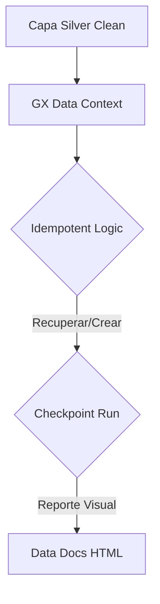

# Ingeniería de Datos: Desafíos y Arquitectura de Soluciones

Este documento detalla los retos técnicos superados y las capacidades avanzadas de auditoría del **RetailNova Lakehouse**.

---

## 1. Topología y Gobernanza de Datos (Delta Time Travel)

Uno de los mayores desafíos en Big Data es la **Trazabilidad de Errores**. Delta Lake soluciona esto mediante el registro de versiones.

**Escenario:** ¿Cómo saber cuándo se aplicó un borrado por derecho al olvido (GDPR)?
**Solución:** Uso de la API de historial de Delta. El comando de ejecución profesional permite ver la evolución de la tabla `ventas_clean`.

```bash
docker exec -it spark-delta python3 -c "...dt.history().show()..."
```

Esta capacidad permite no solo auditar, sino realizar un **Rollback** (volver al pasado) si una carga de datos fuera errónea, garantizando la integridad absoluta del sistema.

---

## 2. Matriz de Desafíos y Resoluciones

| Percance Técnico | Impacto | Solución Implementada |
| :--- | :--- | :--- |
| **Obsolescencia de Imágenes** | El proyecto no iniciaba. | Migración a **Oficial Apache Spark 3.5.1**. |
| **Aislamiento de Contenedores** | Airflow incomunicado. | Mapeo de **Docker Socket**. |
| **Duplicidad de Objetos GX** | Error de metadatos. | Lógica de **Idempotencia** (get_or_create). |
| **Contexto de Spark en CLI** | Error `JavaPackage object not callable`. | Inyección de extensiones Delta y catálogo en la sesión de Spark vía comando CLI completo. |

---

## 3. Modelo de Calidad Empresarial (Data Docs)



---
*Este documento certifica la capacidad de resolución de problemas complejos en entornos distribuidos.*
