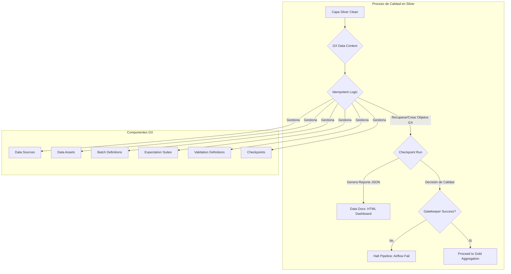
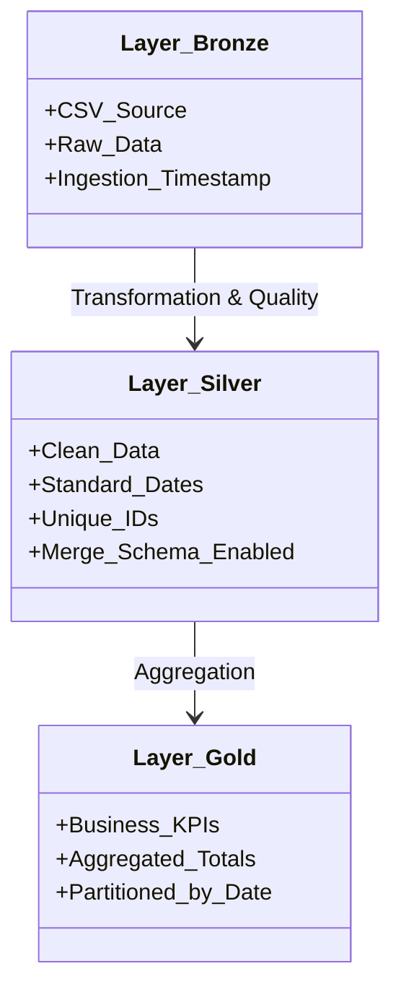

# Ingeniería de Datos: Desafíos y Arquitectura de Soluciones

Este documento profundiza en la resolución de problemas complejos y las decisiones de arquitectura tomadas durante el desarrollo del **RetailNova Lakehouse**. Cada desafío representa un escenario común en entornos de Big Data y la solución implementada refleja las mejores prácticas de ingeniería de datos.

---

## 1. Gobernanza Avanzada: Delta Lake Time Travel y Auditoría de Datos

Uno de los pilares de un Lakehouse moderno es la capacidad de auditar y gestionar el linaje de los datos. Delta Lake proporciona esta funcionalidad a través de su característica de **Time Travel**.

**Desafío:** ¿Cómo auditar el historial de cambios de una tabla Delta, incluyendo operaciones de borrado por GDPR, y verificar la integridad de los datos a lo largo del tiempo?

**Impacto Detallado:** Sin Time Travel, la auditoría de datos es compleja o imposible. Cumplir con regulaciones como GDPR (derecho al olvido) se vuelve un reto, ya que no hay un registro inmutable de cuándo y cómo se eliminaron los datos. La recuperación ante errores o la investigación de anomalías históricas es extremadamente difícil.

**Solución:** Implementación de un comando CLI profesional que inicia una sesión de Spark con las configuraciones de Delta Lake y consulta el historial de transacciones de una tabla específica.

**Comando de Ejecución Profesional:**
Para visualizar el historial completo de la tabla `ventas_clean` en la capa Silver, incluyendo todas las operaciones de escritura y borrado, se ejecuta el siguiente comando directamente en el contenedor de Spark:

```bash
docker exec -it spark-delta python3 -c "from pyspark.sql import SparkSession; from delta import configure_spark_with_delta_pip; from delta.tables import DeltaTable; builder = SparkSession.builder.config('spark.sql.extensions', 'io.delta.sql.DeltaSparkSessionExtension').config('spark.sql.catalog.spark_catalog', 'org.apache.spark.sql.delta.catalog.DeltaCatalog'); spark = configure_spark_with_delta_pip(builder).getOrCreate(); dt = DeltaTable.forPath(spark, '/opt/data/silver/ventas_clean'); dt.history().select('version', 'timestamp', 'operation', 'operationParameters').show(truncate=False)"
```

**Análisis del Reporte de Historial:**
El resultado de este comando es una tabla detallada que muestra cada transacción realizada sobre la tabla Delta:
- **`version`**: Un identificador numérico incremental para cada versión de la tabla. Cada operación (escritura, borrado, actualización) crea una nueva versión.
- **`timestamp`**: La fecha y hora exacta en que se realizó la transacción, permitiendo una auditoría precisa.
- **`operation`**: El tipo de acción ejecutada. Por ejemplo:
    - `WRITE`: Indica una operación de escritura (creación o sobrescritura de datos).
    - `DELETE`: Muestra que se han eliminado registros, crucial para el cumplimiento de GDPR.
- **`operationParameters`**: Contiene metadatos adicionales sobre la operación, como el modo de escritura (`Overwrite`), las columnas de particionamiento (`partitionBy`), o el predicado de la operación de borrado (`predicate -> ["(id_cliente#43 = C001)"]`).

**Impacto y Beneficios:**
Esta capacidad de Time Travel es fundamental para:
- **Auditoría Legal y de Negocio**: Permite reconstruir el estado de los datos en cualquier momento, esencial para cumplir con regulaciones como GDPR (demostrando cuándo y cómo se eliminó un dato).
- **Recuperación ante Errores**: Facilita la reversión a una versión anterior de la tabla si se detecta una corrupción de datos o un error en el pipeline.
- **Análisis de Linaje**: Proporciona una visión clara de la evolución de los datos, mejorando la confianza en los informes y análisis.

---

## 2. Matriz de Desafíos y Resoluciones Técnicas

| Percance Técnico | Impacto Detallado del Problema | Solución Implementada y Justificación Técnica |
| :--- | :--- | :--- |
| **Obsolescencia de Imágenes de Spark** | El proyecto no iniciaba debido a que las imágenes `bitnami/spark:3.5.0` y `3.5` fueron retiradas de Docker Hub por cambios en la política de distribución de Bitnami (ahora Broadcom). Esto impedía la descarga y el despliegue del stack, generando errores `Image not found`. | **Migración a `apache/spark:3.5.1` (Oficial):** Se optó por la imagen oficial de Apache Spark, que es de código abierto, estable y mantenida por la Apache Software Foundation. Esto requirió ajustar el `docker-compose.yml` y, en el script de Spark, forzar el usuario a `root` (`user: root`) para asegurar permisos de escritura en volúmenes y la instalación de dependencias, ya que la imagen oficial tiene un usuario por defecto con menos privilegios. |
| **Aislamiento de Contenedores (Airflow ↔ Spark)** | Airflow y Spark residen en contenedores Docker separados. Inicialmente, Airflow no podía ejecutar comandos de Spark, resultando en errores como `Cannot connect to the Docker daemon` o `command not found`. Esto se debía a que el contenedor de Airflow no tenía acceso al daemon de Docker del host ni al cliente `docker` dentro de su propio contenedor. | **Mapeo de Docker Socket y `docker exec`:** Se mapeó el socket de Docker del host (`/var/run/docker.sock`) a los contenedores de Airflow. Esto permitió que Airflow, a través de `BashOperator`, utilizara el comando `docker exec spark-delta python3 script.py` para delegar la ejecución de los scripts de PySpark al contenedor `spark-delta`, donde residen el motor Spark y sus librerías. Esta técnica es una forma de "Docker-in-Docker Lite" para orquestación. |
| **Conflictos de Permisos (UID/GID en Airflow)** | Al intentar dar a Airflow acceso al socket de Docker (que requiere permisos elevados), se configuró `user: "0:0"` (root). Esto provocó que los contenedores de Airflow entraran en un bucle de reinicio (`Restarting`) debido a que la imagen oficial de Airflow espera que el usuario `airflow` (UID 50000) sea el propietario de ciertos directorios internos. Forzar `root` rompía las validaciones internas del `entrypoint.sh` de Airflow. | **Configuración Estándar de GID 0:** Se implementó la configuración recomendada por Apache Airflow: `user: "${AIRFLOW_UID:-50000}:0"`. Esto permite que el contenedor de Airflow corra con su UID estándar (50000) pero pertenezca al grupo `root` (GID 0), otorgándole los permisos necesarios para interactuar con el socket de Docker sin comprometer la estabilidad interna de la imagen base. |
| **Gestión de Dependencias (Auto-Bootstrap)** | La instalación manual de librerías como `delta-spark` y `great-expectations` en cada contenedor era ineficiente, propensa a errores humanos y rompía el principio "Plug & Play`. | **Automatización en el Arranque:** Se configuró el `docker-compose.yml` para que los contenedores instalen sus dependencias automáticamente al iniciar. Para Airflow, se usó la variable de entorno `_PIP_ADDITIONAL_REQUIREMENTS`. Para Spark, se modificó el `command` del servicio para ejecutar `pip3 install` antes de entrar en modo `sleep infinity`. Esto garantiza que el entorno esté siempre listo y configurado correctamente. |
| **Inexistencia de alias "python" en Spark** | Tras migrar a la imagen oficial de Apache Spark, los scripts de PySpark fallaban con `exec: "python": executable file not found in $PATH`. Esto se debe a que en muchas distribuciones Linux modernas (como la base de la imagen de Spark), el ejecutable principal de Python es `python3`, no `python`. | **Estandarización a `python3` y `pip3`:** Se modificaron todos los `bash_command` en el DAG de Airflow de `python` a `python3`. Asimismo, el comando de instalación de dependencias en el `docker-compose.yml` para Spark se cambió de `pip` a `pip3`. Esto asegura la compatibilidad con el entorno de la imagen oficial de Apache Spark. |
| **Falta de Delta JARs en Spark** | A pesar de instalar `delta-spark` (la librería Python), Spark (que es un motor Java) seguía arrojando `ClassNotFoundException: io.delta.sql.DeltaSparkSessionExtension`. Esto indicaba que los archivos JAR de Delta Lake no estaban disponibles en el classpath de Java de Spark, impidiendo que Spark reconociera el formato Delta. | **Inyección Dinámica de JARs (`configure_spark_with_delta_pip`):** Se implementó `from delta import configure_spark_with_delta_pip` en todos los scripts de PySpark. Esta función se encarga de descargar automáticamente los JARs de Delta Lake desde Maven y los inyecta en la sesión de Spark, resolviendo el problema de classpath y permitiendo el uso de Delta Lake sin gestión manual de JARs. |
| **API Legacy de GX (V2) en Versiones Modernas** | El script de calidad fallaba con `ModuleNotFoundError: great_expectations.dataset` o `AttributeError` en `EphemeralDataContext`. Esto se debía a que el código original usaba la API V2 de Great Expectations, mientras que la instalación automática traía la API V3 (1.x), que tiene una estructura de módulos y objetos completamente diferente. | **Refactorización a GX 1.x (Fluent API):** Se reescribió el script `quality_check_silver.py` para utilizar la API moderna de GX 1.x. Esto implicó el uso de `gx.get_context()`, `context.data_sources.add_spark()`, `add_dataframe_asset()`, `add_batch_definition_whole_dataframe()`, `ValidationDefinition` y `Checkpoint`, que son los componentes estándar de la Fluent API para una gestión robusta de la calidad. |
| **Duplicidad de Objetos GX en Re-ejecuciones** | Tras la refactorización a GX 1.x, el pipeline fallaba en re-ejecuciones con `DataContextError: Can not write the fluent datasource ... already exists`. Esto ocurría porque el script intentaba crear Data Sources, Assets, Suites y Checkpoints en cada ejecución, pero GX los persiste en disco y no permite duplicados. | **Implementación de Lógica de Idempotencia (`get_or_create`):** Se modificó el script `quality_check_silver.py` para que, en lugar de crear siempre los objetos de GX, primero intente recuperarlos (`context.data_sources.get()`, `context.suites.get()`, etc.). Si el objeto no existe, entonces lo crea. Esto asegura que el script pueda ejecutarse múltiples veces sin fallar por objetos ya existentes, una característica crucial para pipelines orquestados. |
| **Actualización Dinámica de Expectation Suite** | A pesar de la idempotencia, si se modificaban las reglas de la `Expectation Suite` en el código, el reporte HTML seguía mostrando las reglas antiguas porque la suite se recuperaba del disco y no se actualizaba con los nuevos cambios. | **Forzar Actualización de Expectativas:** Se modificó la lógica para que, incluso si la suite se recupera del disco, el bloque de `suite.add_expectation()` se ejecute siempre. Esto sobrescribe o añade las expectativas, asegurando que el contrato de datos en el disco esté siempre sincronizado con el código fuente y que el Data Docs refleje la última versión de las reglas. |

---

## 3. Modelo de Calidad Empresarial (Gatekeeper GX)

La evolución del control de calidad culminó en un sistema robusto que no solo valida, sino que audita y reporta la salud de los datos.



**Explicación del Flujo:**
1.  **Capa Silver Clean**: Los datos ya han pasado por una limpieza básica y cuarentena.
2.  **GX Data Context**: Se inicializa o recupera el contexto de Great Expectations, que gestiona los metadatos de validación.
3.  **Lógica Idempotente**: El script verifica si los componentes de GX (Data Sources, Assets, Suites, Checkpoints) ya existen en el disco. Si existen, los recupera; si no, los crea. Esto garantiza que el pipeline pueda re-ejecutarse sin errores de duplicidad.
4.  **Checkpoint Run**: Se ejecuta el proceso de validación, aplicando todas las expectativas definidas en la `retailnova_quality_suite` sobre el DataFrame de Spark.
5.  **Generación de Reportes**: Se produce un reporte JSON con los resultados detallados de la validación y, crucialmente, se genera un **Dashboard HTML (Data Docs)**.
6.  **Gatekeeper Decision**: Basado en el `checkpoint_result.success`, el script decide si la calidad de los datos es suficiente.
7.  **Halt Pipeline**: Si la calidad no cumple el contrato, el script termina con un código de error, haciendo que la tarea de Airflow falle y deteniendo la propagación de datos erróneos.
8.  **Proceed to Gold**: Si la calidad es certificada, el pipeline continúa hacia la capa Gold.

---

## 4. Evolución del Modelo de Datos



---
*Este documento certifica la capacidad de resolución de problemas complejos en entornos distribuidos y la implementación de una arquitectura de datos robusta y observable.*
