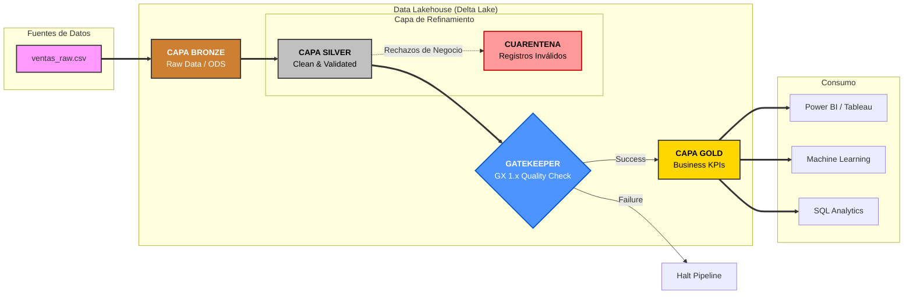
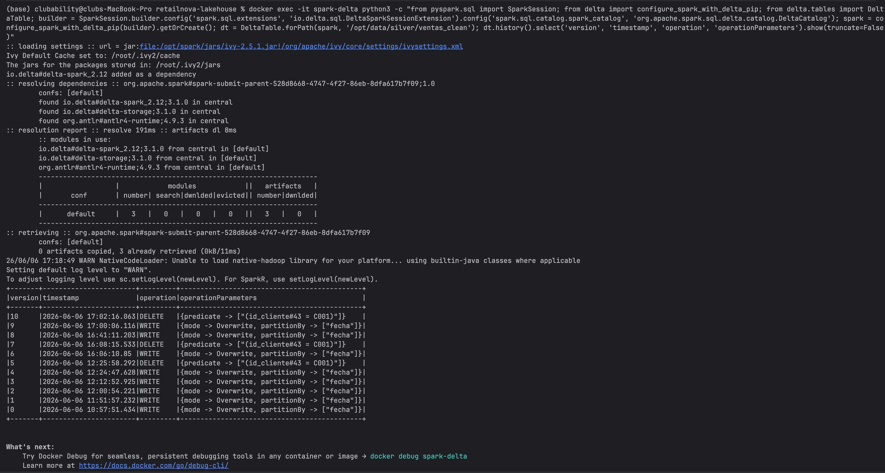
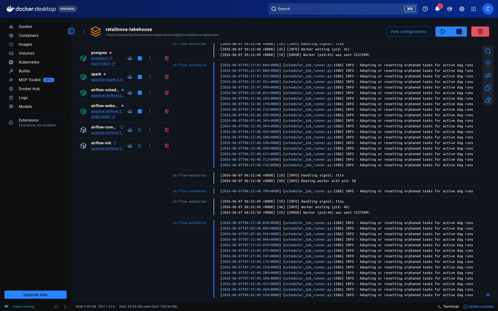
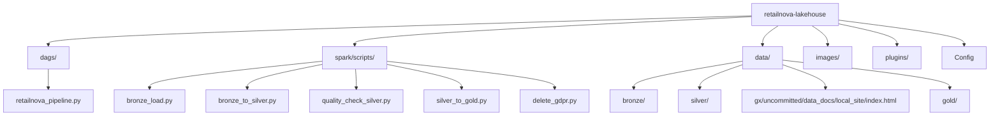

# RetailNova Lakehouse – Enterprise Data Architecture

## Autor
**Carlos Alberto Rivasplata Guerrero**  
**Especialista en Big Data & Business Intelligence**

---

## 1. Descripción del Proyecto
Este proyecto implementa una arquitectura **Data Lakehouse** de última generación para **RetailNova S.A.**, una compañía europea de retail omnicanal. La solución aprovecha el potencial de **Delta Lake** y **Apache Spark**, orquestada por **Apache Airflow** en un ecosistema contenedorizado con **Docker**.

### Objetivos Estratégicos
- **Eficiencia Financiera**: Reducción de costes operativos (OPEX).
- **Calidad de Grado Empresarial**: Validación mediante **Great Expectations 1.x**.
- **Resiliencia Operativa**: Pipeline **Idempotente**.
- **Gobernanza Avanzada**: Capacidad de **Time Travel** y cumplimiento **GDPR**.

---

## 2. Arquitectura de Datos (Patrón Medallion)

La implementación sigue el estándar de la industria para garantizar la integridad y el linaje del dato desde su origen hasta el consumo analítico.



---

## 3. Auditoría y Gobernanza (Time Travel)

Una de las capacidades más potentes de este Lakehouse es la **Auditoría de Versiones (Time Travel)** proporcionada por Delta Lake. Esto permite reconstruir el estado de los datos en cualquier punto del tiempo.

### Cómo visualizar el historial de cambios
Ejecuta el siguiente comando profesional en tu terminal para auditar las versiones de la capa Silver (incluyendo procesos de carga y borrados GDPR):

```bash
docker exec -it spark-delta python3 -c "from pyspark.sql import SparkSession; from delta import configure_spark_with_delta_pip; from delta.tables import DeltaTable; builder = SparkSession.builder.config('spark.sql.extensions', 'io.delta.sql.DeltaSparkSessionExtension').config('spark.sql.catalog.spark_catalog', 'org.apache.spark.sql.delta.catalog.DeltaCatalog'); spark = configure_spark_with_delta_pip(builder).getOrCreate(); dt = DeltaTable.forPath(spark, '/opt/data/silver/ventas_clean'); dt.history().select('version', 'timestamp', 'operation', 'operationParameters').show(truncate=False)"
```

**¿Qué se puede observar en el reporte?**
- **Version**: ID incremental de cada transacción.
- **Timestamp**: Fecha y hora exacta del cambio.
- **Operation**: El tipo de acción ejecutada (`WRITE`, `DELETE`, `UPDATE`).
- **OperationParameters**: El predicado o regla aplicada (ej. `id_cliente = 'C001'` en procesos GDPR).


*Ilustración 1: Reporte de historial de Delta Lake mostrando operaciones de escritura y borrado (GDPR).*

---

## 4. Visualización de Resultados

### Perfil de Negocio (GX Data Docs)
Dashboard interactivo que certifica la salud del Lakehouse. 
- **Ubicación**: `data/gx/uncommitted/data_docs/local_site/index.html`


*Ilustración 2: Vista general del dashboard de Great Expectations, mostrando el cumplimiento del contrato de datos y el detalle de las reglas por columna.*

### Perfil de Orquestación (Airflow)
Control visual del flujo de tareas en [http://localhost:8080](http://localhost:8080).


*Ilustración 3: Gráfico del DAG de Airflow con todas las tareas completadas exitosamente, indicando un flujo de datos sin interrupciones.*


*Ilustración 4: Fragmento del log de una tarea exitosa en Airflow, mostrando la confirmación de la ejecución y los mensajes de certificación de calidad.*

---

## 5. Guía de Ejecución "Plug & Play"

### Preparación del Entorno
```bash
# Levantar el stack completo (Auto-Bootstrap de dependencias vía pip3)
docker compose up -d
```

*Ilustración 5: Vista de Docker Desktop mostrando todos los contenedores del stack en su estado operativo (Running o Exited), confirmando el despliegue de la infraestructura.*

1. Entrar a Airflow.
2. Activar DAG `retailnova_lakehouse_pipeline`.
3. Ejecutar (Trigger).

---

## 6. Estructura de Directorios



*Ilustración 6: Vista de la estructura de carpetas del proyecto en el IDE, mostrando la organización de los componentes del Lakehouse.*


*Ilustración 7: Vista del explorador de archivos mostrando la estructura de particionamiento por fecha en la capa Gold, optimizada para consultas analíticas.*

---
*Este proyecto es una demostración integral de ingeniería de datos moderna, combinando robustez técnica con una visión clara del valor de negocio.*
