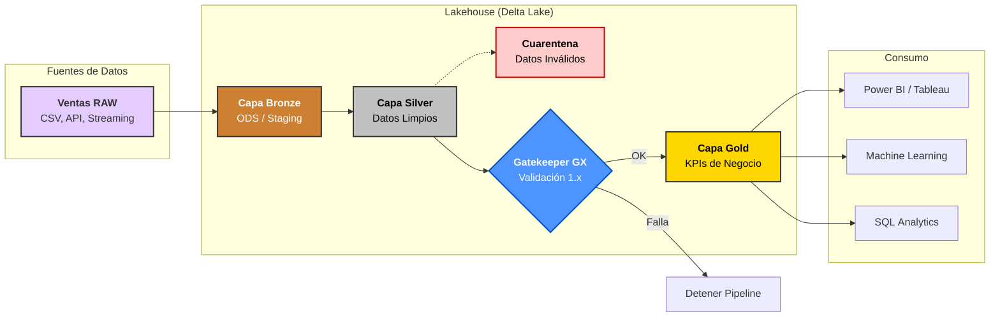
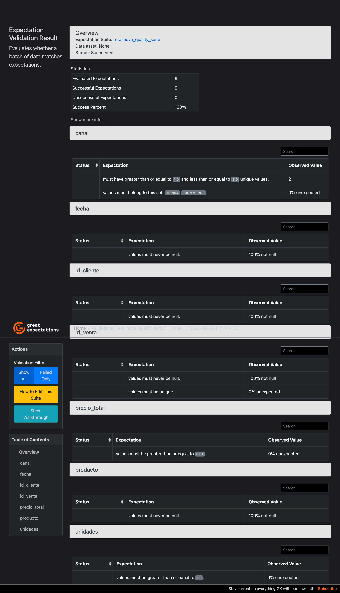
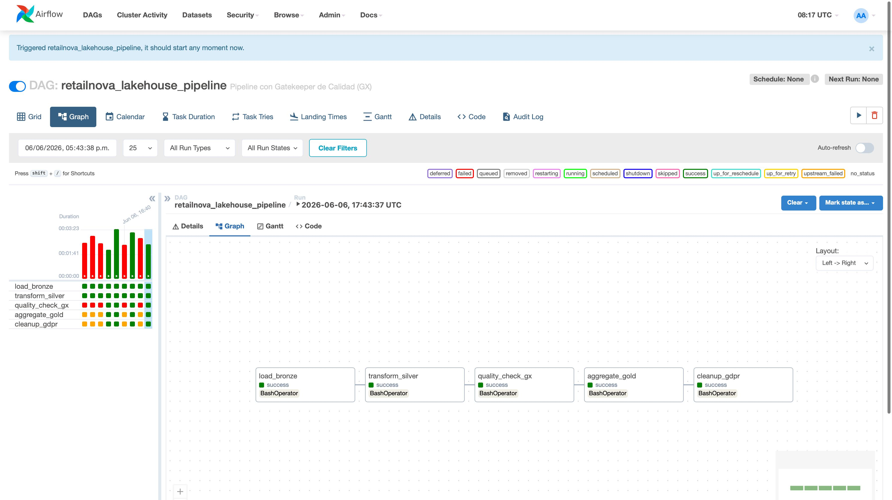
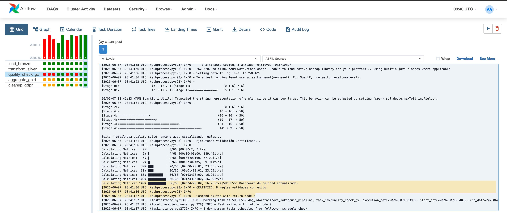
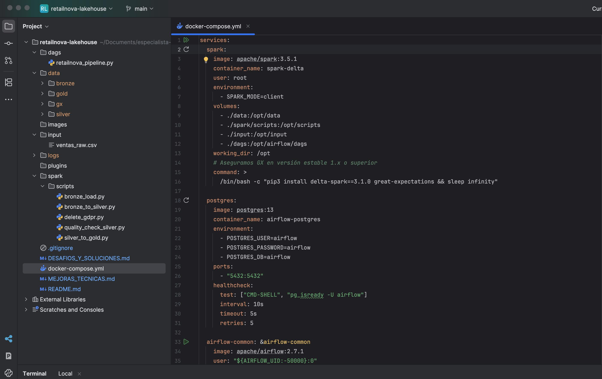
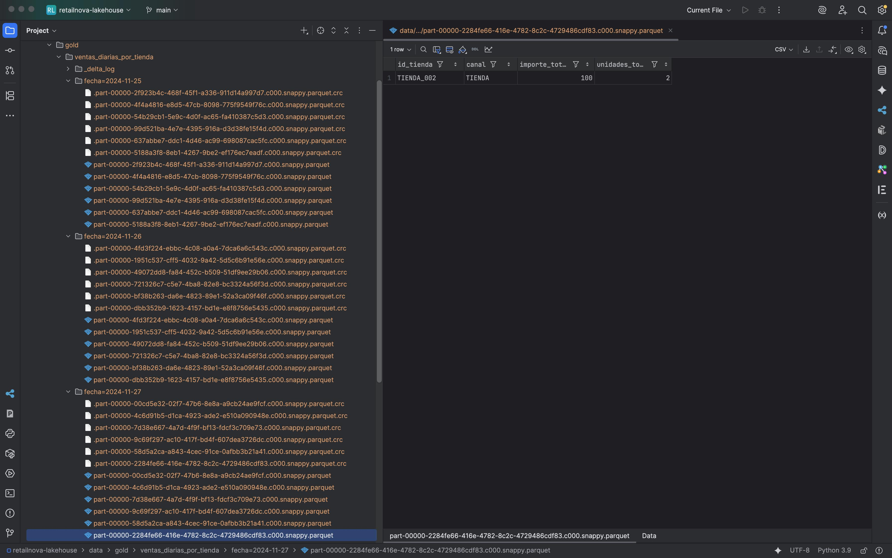

# RetailNova Lakehouse – Enterprise Data Architecture

## Autor
**Carlos Alberto Rivasplata Guerrero**  
**Especialista en Big Data & Business Intelligence**

---

## Índice
1. [Descripción del Proyecto](#1-descripción-del-proyecto)  
2. [Arquitectura de Datos (Patrón Medallion)](#2-arquitectura-de-datos-patrón-medallion)  
3. [Auditoría y Gobernanza (Time Travel)](#3-auditoría-y-gobernanza-time-travel)  
4. [Visualización de Resultados](#4-visualización-de-resultados)  
5. [Guía de Ejecución "Plug & Play"](#5-guía-de-ejecución-plug--play)  
6. [Estructura de Directorios](#6-estructura-de-directorios)  
7. [Requisitos y Entorno](#7-requisitos-y-entorno)  
8. [Referencias y Documentos Relacionados](#8-referencias-y-documentos-relacionados)

---

## 1. Descripción del Proyecto

RetailNova Lakehouse es una arquitectura de datos de última generación diseñada para soportar el negocio omnicanal de **RetailNova S.A.**, una compañía europea que opera en múltiples canales de venta (tienda física, e‑commerce, marketplace y cliente corporativo).  Su objetivo es convertir grandes volúmenes de datos operativos en conocimiento accionable de forma eficiente.  Para ello se apoya en tecnologías modernas como **Delta Lake** y **Apache Spark** para la persistencia y procesamiento, **Apache Airflow** para la orquestación y **Great Expectations** para la validación de calidad.  El proyecto se ejecuta mediante contenedores **Docker** para facilitar su despliegue y portabilidad.

### Objetivos Estratégicos

- **Eficiencia Financiera**: reducir los costes operativos (OPEX) a través de procesos automatizados y escalables.  
- **Calidad de Grado Empresarial**: garantizar que los datos cumplen reglas de negocio mediante un contrato de calidad con Great Expectations.  
- **Resiliencia Operativa**: diseñar un flujo **idempotente** y tolerante a errores que pueda re‑ejecutarse sin efectos adversos.  
- **Gobernanza Avanzada**: aprovechar la capacidad de **Time Travel** de Delta Lake para auditar versiones y cumplir regulaciones como el GDPR.  
- **Contexto Logístico**: optimizar la cadena de suministro aprovechando Big Data para mejorar la eficiencia, prever la demanda, reducir tiempos de entrega y optimizar rutas【288113354052796†L250-L260】【288113354052796†L295-L307】.

RetailNova opera en un contexto logístico complejo.  Las tendencias de crecimiento del comercio electrónico y la deslocalización de almacenes exigen una mayor visibilidad y capacidad de reacción en la cadena de suministro.  Según estudios recientes, más del 90 % de las grandes empresas invierten en tecnologías de Big Data aplicadas a logística【288113354052796†L250-L255】.  Para responder a preguntas de negocio (¿cómo optimizar el uso de combustible?, ¿cómo reducir tiempos de entrega?, ¿cómo mejorar el servicio al cliente?) es necesario capturar datos de múltiples fuentes (GPS, sensores, sistemas de gestión, patrones de consumo y datos meteorológicos)【288113354052796†L295-L307】.  La arquitectura Lakehouse se convierte en el núcleo donde convergen y se analizan estos datos para la toma de decisiones.

---

## 2. Arquitectura de Datos (Patrón Medallion)

La arquitectura adopta el patrón **Medallion** para estructurar los datos en tres capas: **Bronze**, **Silver** y **Gold**.  Esta disposición garantiza el linaje del dato y facilita su evolución desde el estado bruto hasta la forma analítica.  A continuación se muestra un diagrama mejorado del flujo de datos:



**Explicación del Diagrama:**

- **Capa Bronze**: almacena datos crudos procedentes de múltiples fuentes (CSV, APIs, sensores), preservando su integridad para auditorías.  
- **Capa Silver**: transforma los datos mediante limpieza, tipificación y deduplicación; aplica particionamiento por fecha para mejorar el rendimiento.  
- **Capa Gold**: agrega y modela métricas de negocio (ventas diarias por tienda, canal y producto) y se usa para reporting, analítica avanzada o entrenamiento de modelos.  
- **Cuarentena**: separa registros inválidos para su revisión sin detener la operativa.  
- **Gatekeeper GX**: valida la capa Silver con un contrato de ocho reglas; si se cumplen, promueve a Gold, de lo contrario detiene el pipeline.  
- **Consumo**: herramientas de Business Intelligence, Machine Learning y análisis ad hoc consumen datos de la capa Gold.

---

## 3. Auditoría y Gobernanza (Time Travel)

Una característica diferencial de Delta Lake es su capacidad de **Time Travel**.  Cada operación sobre una tabla (inserción, actualización, borrado) crea una nueva versión inmutable, permitiendo reconstruir el estado de los datos en cualquier momento.  Esta funcionalidad es esencial para la auditoría legal y de negocio, la recuperación ante errores y la trazabilidad del linaje del dato【turn8file0†L73-L112】.

### Cómo visualizar el historial de cambios

Puedes auditar la tabla `ventas_clean` en la capa Silver ejecutando el siguiente comando dentro del contenedor `spark-delta`:

```bash
docker exec -it spark-delta python3 -c "from pyspark.sql import SparkSession; from delta import configure_spark_with_delta_pip; from delta.tables import DeltaTable; builder = SparkSession.builder.config('spark.sql.extensions','io.delta.sql.DeltaSparkSessionExtension').config('spark.sql.catalog.spark_catalog','org.apache.spark.sql.delta.catalog.DeltaCatalog'); spark = configure_spark_with_delta_pip(builder).getOrCreate(); dt = DeltaTable.forPath(spark, '/opt/data/silver/ventas_clean'); dt.history().select('version','timestamp','operation','operationParameters').show(truncate=False)"
```

El reporte resultante muestra columnas como `version`, `timestamp`, `operation` y `operationParameters`, indicando la evolución y el contexto de cada transacción.  En los procesos de borrado por GDPR, el predicado (`id_cliente = 'C001'`) queda registrado para demostrar el cumplimiento normativo.

---

## 4. Visualización de Resultados

### Perfil de Negocio (GX Data Docs)

Great Expectations genera automáticamente un dashboard interactivo que documenta el estado de la calidad de los datos.  Este informe se encuentra en `data/gx/uncommitted/data_docs/local_site/index.html` y presenta el resultado de las validaciones regla a regla.  Es accesible desde cualquier navegador web.

  
*Ilustración 2: Vista del dashboard de Great Expectations, con el cumplimiento del contrato de datos y detalles por columna【turn8file0†L97-L103】.*

### Perfil de Orquestación (Airflow)

La interfaz de **Apache Airflow** te permite visualizar y monitorizar el DAG `retailnova_lakehouse_pipeline`.  En ella se puede observar el estado de cada tarea, reintentos y duración, así como acceder a los logs individuales.

  
*Ilustración 3: Gráfico del DAG de Airflow con las tareas completadas de forma satisfactoria【turn8file0†L104-L112】.*

  
*Ilustración 4: Fragmento de los logs de Airflow de una tarea exitosa, mostrando mensajes de certificación de calidad【turn8file0†L104-L112】.*

---

## 5. Guía de Ejecución "Plug & Play"

La ejecución del proyecto se ha simplificado al máximo para que cualquier persona pueda desplegarlo sin necesidad de configurar manualmente dependencias.  A continuación se describen los pasos a seguir:

1. **Preparación del Entorno**
   
   Ejecuta el siguiente comando para iniciar los contenedores y bootstrapear automáticamente todas las dependencias:
   
   ```bash
   docker compose up -d
   ```

   Esto levantará los servicios de Spark y Airflow, instalará las librerías `delta-spark` y `great-expectations` en el contenedor de Spark y habilitará la interfaz de Airflow en [http://localhost:8080](http://localhost:8080).

2. **Activar y ejecutar el DAG**
   
   Una vez iniciado Airflow, accede al panel web, activa el DAG `retailnova_lakehouse_pipeline` y pulsa en **Trigger** para ejecutar el pipeline.

3. **Verificar resultados**
   
   - Comprueba el estado de las tareas y sus logs en Airflow.  
   - Accede al reporte de calidad `data/gx/uncommitted/data_docs/local_site/index.html` para analizar las métricas de validación.  
   - Consulta las tablas Delta en las carpetas `data/bronze`, `data/silver` y `data/gold`.

---

## 6. Estructura de Directorios

La siguiente tabla explica la organización de carpetas y archivos en el proyecto.  Esta estructura sigue las mejores prácticas para proyectos de datos, separando la lógica (scripts), la orquestación (dags), los datos y la documentación.

```mermaid
classDiagram
    class Proyecto {
        +README.md
        +dags/
        +spark/scripts/
        +data/
        +images/
        +docs/
        +plugins/
        +.env
    }
    class dags {
        +retailnova_pipeline.py
    }
    class scripts {
        +bronze_load.py
        +bronze_to_silver.py
        +quality_check_silver.py
        +silver_to_gold.py
        +delete_gdpr.py
    }
    class data {
        +bronze/
        +silver/
        +gold/
        +gx/
    }
    class images {
        +*.jpeg, *.png
    }
    class docs {
        +MEJORAS_TECNICAS.md
        +DESAFIOS_Y_SOLUCIONES.md
        +SCRIPTS.md
        +CONTEXTO_EMPRESARIAL.md
        +CONTRIBUTING.md
    }
    Proyecto --> dags
    Proyecto --> scripts
    Proyecto --> data
    Proyecto --> images
    Proyecto --> docs
    Proyecto --> plugins
    Projecto --> envFile[".env"]
```

  
*Ilustración 6: Vista de la estructura de carpetas del proyecto en el IDE【turn8file0†L131-L158】.*

  
*Ilustración 7: Explorador de archivos mostrando la estructura de particionamiento por fecha en la capa Gold【turn8file0†L160-L161】.*

---

## 7. Requisitos y Entorno

Para ejecutar este Lakehouse se recomienda configurar el entorno con los siguientes requisitos:

- **Sistema operativo**: macOS, Windows o Linux con **Docker Desktop**.  
- **Docker Compose**: versión ≥ 1.29.  
- **Recursos mínimos asignados a Docker**: 4 GB de RAM y 2 vCPUs (configurables en *Settings → Resources* de Docker Desktop).  
- **Espacio en disco**: al menos 2 GB libres para datos y artefactos.  
- **Navegador web**: para visualizar Airflow y los Data Docs de GX.  
- **Ajustes de Airflow**: en máquinas lentas, aumenta el parámetro `AIRFLOW__WEBSERVER__WEB_SERVER_WORKER_TIMEOUT` (por ejemplo a 300 segundos) para evitar que Gunicorn finalice los workers si tardan en cargar los DAGs.  
- **Contexto Logístico**: para obtener valor del Big Data en logística es crucial capturar datos de la flota (GPS), operaciones (RFID, sensores), alertas de clientes y patrones de consumo【288113354052796†L295-L307】.  Estas fuentes permiten mejorar la previsión de demanda, optimizar rutas y reducir el tiempo de entrega【288113354052796†L352-L365】.

---

## 8. Referencias y Documentos Relacionados

Este README se acompaña de varios documentos en la carpeta **docs/** que profundizan en las mejoras técnicas, los desafíos enfrentados y la guía de scripts:

- [`docs/MEJORAS_TECNICAS.md`](docs/MEJORAS_TECNICAS.md) – Describe las optimizaciones implementadas (configuración de Spark, particionamiento, calidad de datos, etc.).  
- [`docs/DESAFIOS_Y_SOLUCIONES.md`](docs/DESAFIOS_Y_SOLUCIONES.md) – Aborda los retos técnicos y presenta la matriz de soluciones adoptadas.  
- [`docs/SCRIPTS.md`](docs/SCRIPTS.md) – Documenta la funcionalidad de cada script de PySpark y del DAG de Airflow.  
- [`docs/CONTEXTO_EMPRESARIAL.md`](docs/CONTEXTO_EMPRESARIAL.md) – Explica el contexto logístico y de negocio que motiva la adopción de la arquitectura Lakehouse.  
- [`docs/CONTRIBUTING.md`](docs/CONTRIBUTING.md) – Proporciona directrices para contribuir de manera profesional al proyecto.

---

*Este proyecto es una demostración integral de ingeniería de datos moderna.  Combina robustez técnica con una visión clara del valor de negocio, y se adapta al entorno logístico de RetailNova para mejorar la eficiencia operativa y la toma de decisiones.*