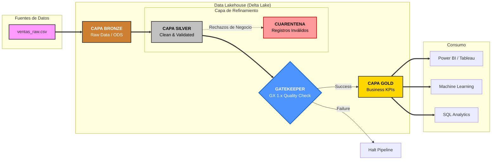

# RetailNova Lakehouse – Enterprise Data Architecture

## Autor
**Carlos Alberto Rivasplata Guerrero**  
**Especialista en Big Data & Business Intelligence**

---

## 1. Descripción del Proyecto
Este proyecto implementa una arquitectura **Data Lakehouse** de última generación para **RetailNova S.A.**, una compañía europea de retail omnicanal. La solución aprovecha el potencial de **Delta Lake** y **Apache Spark**, orquestada por **Apache Airflow** en un ecosistema contenedorizado con **Docker**.

### Objetivos Estratégicos
- **Eficiencia Financiera**: Reducción de costes operativos (OPEX).
- **Calidad de Grado Empresarial**: Validación mediante **Great Expectations 1.x**.
- **Resiliencia Operativa**: Pipeline **Idempotente**.
- **Gobernanza Avanzada**: Capacidad de **Time Travel** y cumplimiento **GDPR**.

---

## 2. Arquitectura de Datos (Patrón Medallion)



---

## 3. Auditoría y Gobernanza (Time Travel)

Una de las capacidades más potentes de este Lakehouse es la **Auditoría de Versiones (Time Travel)** proporcionada por Delta Lake. Esto permite reconstruir el estado de los datos en cualquier punto del tiempo.

### Cómo visualizar el historial de cambios
Ejecuta el siguiente comando profesional en tu terminal para auditar las versiones de la capa Silver (incluyendo procesos de carga y borrados GDPR):

```bash
docker exec -it spark-delta python3 -c "from pyspark.sql import SparkSession; from delta import configure_spark_with_delta_pip; from delta.tables import DeltaTable; builder = SparkSession.builder.config('spark.sql.extensions', 'io.delta.sql.DeltaSparkSessionExtension').config('spark.sql.catalog.spark_catalog', 'org.apache.spark.sql.delta.catalog.DeltaCatalog'); spark = configure_spark_with_delta_pip(builder).getOrCreate(); dt = DeltaTable.forPath(spark, '/opt/data/silver/ventas_clean'); dt.history().select('version', 'timestamp', 'operation', 'operationParameters').show(truncate=False)"
```

**¿Qué se puede observar en el reporte?**
- **Version**: ID incremental de cada transacción.
- **Timestamp**: Fecha y hora exacta del cambio.
- **Operation**: El tipo de acción ejecutada (`WRITE`, `DELETE`, `UPDATE`).
- **OperationParameters**: El predicado o regla aplicada (ej. `id_cliente = 'C001'` en procesos GDPR).

---

## 4. Visualización de Resultados

### Perfil de Negocio (GX Data Docs)
Dashboard interactivo que certifica la salud del Lakehouse. 
- **Ubicación**: `data/gx/uncommitted/data_docs/local_site/index.html`

### Perfil de Orquestación (Airflow)
Control visual del flujo de tareas en [http://localhost:8080](http://localhost:8080).

---

## 5. Guía de Ejecución "Plug & Play"
```bash
docker compose up -d
```
1. Entrar a Airflow.
2. Activar DAG `retailnova_lakehouse_pipeline`.
3. Ejecutar (Trigger).

---
*Este proyecto demuestra la convergencia entre ingeniería de datos, gobernanza legal y observabilidad empresarial.*
