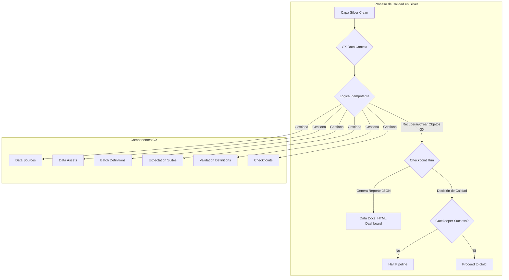
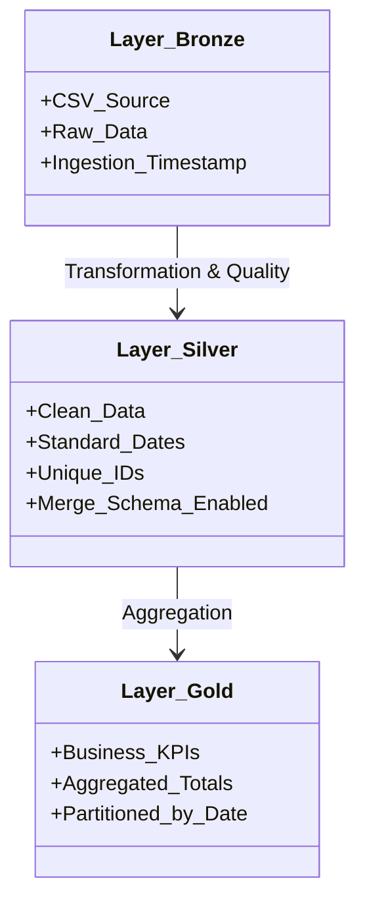

# Ingeniería de Datos: Desafíos y Arquitectura de Soluciones

Este documento profundiza en la resolución de problemas complejos y las decisiones de arquitectura tomadas durante el desarrollo del **RetailNova Lakehouse**.  Cada desafío representa un escenario común en entornos de Big Data y la solución implementada refleja las mejores prácticas de ingeniería de datos.  Como especialista en Big Data, se contextualiza cada problema dentro del entorno logístico y operativo de RetailNova.

---

## Índice
1. [Gobernanza Avanzada: Delta Lake Time Travel y Auditoría de Datos](#1-gobernanza-avanzada-delta-lake-time-travel-y-auditoría-de-datos)  
2. [Matriz de Desafíos y Resoluciones Técnicas](#2-matriz-de-desafíos-y-resoluciones-técnicas)  
3. [Modelo de Calidad Empresarial (Gatekeeper GX)](#3-modelo-de-calidad-empresarial-gatekeeper-gx)  
4. [Evolución del Modelo de Datos](#4-evolución-del-modelo-de-datos)  
5. [Referencias](#5-referencias)

---

## 1. Gobernanza Avanzada: Delta Lake Time Travel y Auditoría de Datos

Uno de los pilares de un Lakehouse moderno es la capacidad de auditar y gestionar el linaje de los datos.  **Delta Lake** proporciona esta funcionalidad mediante su característica de **Time Travel**.  Esta funcionalidad es especialmente relevante en un entorno logístico donde se registran continuamente eventos como pedidos, envíos y devoluciones.

### Desafío

¿Cómo auditar el historial de cambios de una tabla Delta, incluyendo operaciones de borrado por GDPR, y verificar la integridad de los datos a lo largo del tiempo?

### Impacto Detallado

Sin Time Travel, la auditoría de datos se vuelve compleja o imposible.  Cumplir con regulaciones como GDPR se convierte en un reto, ya que no existe un registro inmutable de cuándo y cómo se eliminaron los datos.  Además, la recuperación ante errores o la investigación de anomalías históricas es extremadamente difícil.

### Solución

Se implementó un comando CLI profesional que inicia una sesión de Spark configurada con Delta Lake y consulta el historial de transacciones de una tabla específica.  El comando completo se detalla en el README y en el primer desafío, mostrando las columnas `version`, `timestamp`, `operation` y `operationParameters`.

### Análisis del Reporte de Historial

El resultado del comando es una tabla detallada con la versión, marca de tiempo, tipo de operación (`WRITE`, `DELETE`, `UPDATE`) y parámetros de operación.  Esta información permite rastrear los cambios a nivel granular y demostrar el cumplimiento de regulaciones.  Es útil para:

- **Auditoría Legal y de Negocio**: reconstruir el estado de los datos en cualquier momento y demostrar cuándo y cómo se eliminó información sensible【288113354052796†L250-L260】.  
- **Recuperación ante Errores**: revertir a una versión anterior de la tabla si se detecta una corrupción o un error en el pipeline.  
- **Análisis de Linaje**: visualizar la evolución de los datos para aumentar la confianza en los informes y análisis.

---

## 2. Matriz de Desafíos y Resoluciones Técnicas

| Percance Técnico | Impacto Detallado del Problema | Solución Implementada y Justificación Técnica |
| :--- | :--- | :--- |
| **Obsolescencia de Imágenes de Spark** | El proyecto no iniciaba debido a que las imágenes `bitnami/spark:3.5.0` y `3.5` fueron retiradas de Docker Hub.  Esto impedía la descarga y el despliegue del stack, generando errores `Image not found`. | **Migración a `apache/spark:3.5.1`**: se optó por la imagen oficial de Apache Spark, que es de código abierto y mantenida por la Apache Software Foundation.  Se forzó el usuario a `root` para instalar dependencias y escribir en volúmenes, ya que la imagen oficial utiliza un usuario con menos privilegios. |
| **Aislamiento de Contenedores (Airflow ↔ Spark)** | Airflow y Spark residen en contenedores separados.  Inicialmente, Airflow no podía ejecutar comandos de Spark, resultando en errores como `Cannot connect to the Docker daemon`. | **Mapeo de Docker Socket**: se mapeó `/var/run/docker.sock` al contenedor de Airflow, permitiendo ejecutar scripts en Spark mediante `docker exec spark-delta python3 script.py`. |
| **Conflictos de Permisos (UID/GID en Airflow)** | Configurar Airflow como `root` causó reinicios constantes porque la imagen espera un UID específico. | **Configuración Recomendada**: se utilizó `user: "${AIRFLOW_UID:-50000}:0"`, permitiendo al contenedor pertenecer al grupo root para acceder al socket de Docker sin romper la inicialización interna. |
| **Gestión de Dependencias (Auto‑Bootstrap)** | Instalar manualmente `delta-spark` y `great-expectations` en cada contenedor era ineficiente y propenso a errores. | **Automatización en el Arranque**: se configuró `docker-compose.yml` para instalar dependencias automáticamente al iniciar los contenedores (variables `_PIP_ADDITIONAL_REQUIREMENTS` y script de instalación en Spark). |
| **Falta de Alias `python` en Spark** | Tras migrar a la imagen oficial, los scripts fallaban con `exec: "python": executable file not found` porque el ejecutable principal es `python3`. | **Estandarización a `python3` y `pip3`**: se actualizaron todos los comandos y scripts para usar `python3` y `pip3`. |
| **Falta de Delta JARs en Spark** | La librería `delta-spark` por sí sola no descarga los JARs necesarios, provocando `ClassNotFoundException`. | **Inyección Dinámica de JARs**: se utilizó `configure_spark_with_delta_pip` para descargar e inyectar los JARs de Delta en la sesión de Spark. |
| **API Legacy de GX (v2) en Versiones Modernas** | El script de calidad fallaba porque usaba la API V2 de Great Expectations, mientras que la versión instalada era 1.x. | **Refactorización a la Fluent API 1.x**: se reescribió el script `quality_check_silver.py` usando la nueva API (`gx.get_context()`, `datasources.add_spark()`, etc.). |
| **Duplicidad de Objetos GX en Re‑ejecuciones** | GX persistía Data Sources, Suites y Checkpoints; la re‑ejecución generaba errores de duplicidad. | **Idempotencia `get_or_create`**: el script verifica si el objeto existe; si no, lo crea; si sí, lo recupera. |
| **Actualización de Expectation Suite** | Las modificaciones en el código no se reflejaban en la suite persistida. | **Forzar Actualización**: el script sobrescribe o añade expectativas en cada ejecución, asegurando que las reglas en disco se sincronicen con el código. |

---

## 3. Modelo de Calidad Empresarial (Gatekeeper GX)

La evolución del control de calidad culminó en un sistema robusto que no solo valida, sino que audita y reporta la salud de los datos.  La siguiente figura describe el flujo del proceso de validación:

**Explicación del Flujo:**

1. **Capa Silver Clean**: los datos han sido limpiados y tipificados, listos para ser validados.  
2. **GX Data Context**: inicializa o recupera el contexto de GX que gestiona los metadatos de validación.  
3. **Lógica Idempotente**: se comprueba si ya existen Data Sources, Assets, Suites y Checkpoints; si existen, se reutilizan; si no, se crean.  
4. **Checkpoint Run**: ejecuta todas las expectativas del contrato sobre el DataFrame de Spark.  
5. **Generación de Reportes**: produce un JSON de resultados y un **dashboard HTML** que documenta cada regla.  
6. **Gatekeeper Decision**: si el resultado es exitoso (`checkpoint_result.success = True`), el pipeline continúa a Gold; de lo contrario, se detiene y se registra la causa en el log.  
7. **Halt Pipeline / Proceed to Gold**: detiene el pipeline y envía notificaciones o promueve los datos a la capa Gold según corresponda.

---

## 4. Evolución del Modelo de Datos

El diseño del modelo de datos también ha evolucionado conforme se profundizaba en la arquitectura.  El diagrama de clases siguiente resume las capas y sus principales características:

En la capa Bronze se conservan los datos tal como llegan y se añade un sello de tiempo de ingestión.  En Silver se normalizan las fechas, se eliminan duplicados y se habilita la evolución del esquema.  En Gold se calculan los KPIs de negocio y se organizan los datos por fecha para su consumo analítico.

---

## 5. Referencias

- [README.md](../README.md) – Guía general del proyecto y contexto logístico.  
- [MEJORAS_TECNICAS.md](MEJORAS_TECNICAS.md) – Descripción de las optimizaciones implementadas en el pipeline.  
- [SCRIPTS.md](SCRIPTS.md) – Documentación detallada de los scripts y del DAG de Airflow.  
- **Artículo sobre Big Data en logística**: el Big Data permite mejorar la eficiencia de las empresas logísticas, optimizar rutas, realizar mantenimiento preventivo y gestionar mejor el stock【288113354052796†L250-L260】【288113354052796†L352-L365】.

---

*Este documento certifica la capacidad de resolver problemas complejos en entornos distribuidos y la implementación de una arquitectura de datos robusta, auditada y escalable.*